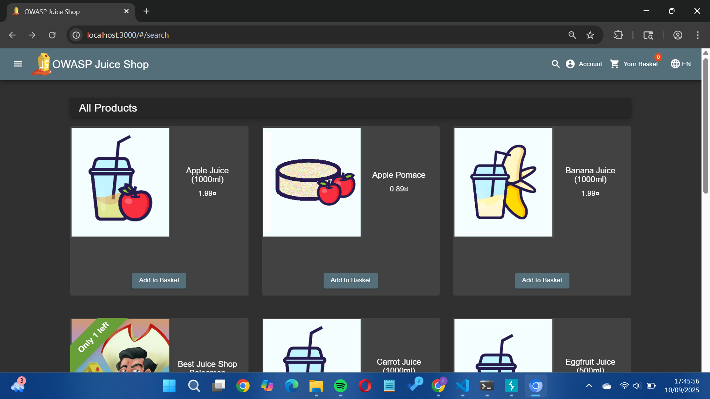

## CHRISTMAS SPECIAL

Revalina Fairuzy Azhari Putri / 5027231001

Source: https://demo.owasp-juice.shop/#/score-board?categories=Injection

**Langkah-langkah:**

1. Sama seperti pada *challenge Database Schema*, `http://localhost:3000/rest/products/search?q=` merupakan titik vuknerability pada sistem ini. 

2. Oleh karena itu, kita input pada *search bar*, serta kita tambahkan payload `')) UNION SELECT * FROM PRODUCTS WHERE deletedAt IS NOT NULL--`.

3. Sesuai yang diminta pada soal, kita disuruh untuk mencari produk dengan nama Christmas. Pada database produk ini dapat diketahui, terdapat produk bernama `Christmas Super-Surprise-Box (2014 Edition)` dengan ID: 10.

4. Buka burpsuite dan buka *cloning chrome* serta masukkan `http://localhost:30`. Coba masuk menggunakan akun Jim (dari case *Login Jim*) lalu coba *check out* beberapa barang.

5. Coba cek history dan dapatkan suatu log dengan command *post* yang mana itu adalah riwayat dari *check out* yang coba kita lakukan tadi.

6. Kirim log nya ke intruder dan coba ubah ID dari barang yang coba kita check out tadi menjadi 10 (Sesuai ID barang Christmas), lalu klik send.

7. Kembali ke *cloning chrome* dan refresh web, lalu masuk ke history checkout.Nantinya akan tertampil barang dengan nama `Christmas Super-Surprise-Box (2014 Edition)` dengan status suda kita masukkan keranjang

- Hasil: Berhasil

- Alasan: Celah di endpoint `q` pada fitur search dimanfaatkan untuk menjalankan SQL Injection yang mengungkap produk tersembunyi bernama Christmas Super-Surprise-Box (2014 Edition) dengan ID 10. Kemudian, dengan menggunakan BurpSuite Intruder, ID produk checkout dimodifikasi menjadi 10, sehingga sistem menganggap pengguna berhasil membeli produk tersembunyi itu. Hal ini terjadi karena web tidak melakukan validasi yang memadai terhadap input maupun ID produk pada request checkout.

- Refleksi: Percobaan ini menunjukkan bahwa kerentanan SQL Injection tidak hanya berbahaya untuk mengungkap data, tetapi juga dapat dimanfaatkan untuk memodifikasi perilaku aplikasi (seperti membeli item tersembunyi).