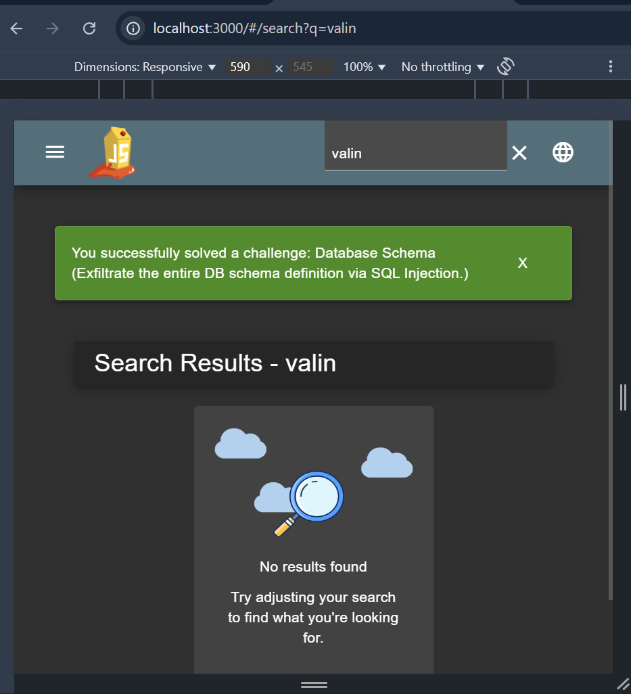

## Database Schema

Revalina Fairuzy Azhari Putri / 5027231001

Source: https://demo.owasp-juice.shop/#/score-board?categories=Injection

**Langkah-langkah:**

1. Pertama kita coba melakukan inspect (ctrl+shift+i) sembari memasukkan suatu kata pada *search section*, disini kita coba dengan kata 'valin'.

    Karena kata 'valin' bukan merupakan sesuatu yang ada di dalam sistem, maka ia menunjukkan *No Result Found*.

    Saat kita cek *network* pada inspect, lalu masuk ke `search?q`, kita dapat melihat request URL nya yaitu `http://localhost:3000/rest/products/search?q=`. Ini menunjukkan parameter q digunakan untuk pencarian produk.

2. Saat kita lakukan *search* untuk `http://localhost:3000/rest/products/search?q=` respon menunjukkan data json pada sistem tersebut. 

3. Masukkan payload `')) UNION SELECT 1,2,3,4,5,6,7,8,sql FROM sqlite_schema--` pada *search bar*, sehingga menjadi `http://localhost:3000/rest/products/search?q=%27))%20UNION%20SELECT%201,2,3,4,5,6,7,8,sql%20FROM%20sqlite_schema--`

4. Tertampil definisi struktur database, sehingga dari hal ini dapat menjadi suatu kerentanan untuk penyerang

5. Tertampil jika kita sudah berhasil menyelesaikan case

- Hasil: Berhasil

- Alasan: Dengan memanfaatkan parameter q di fitur search, penyerang dapat memasukkan payload SQL Injection (')) UNION SELECT ... FROM sqlite_schema--) yang akhirnya menampilkan struktur database (sqlite_schema). Hal ini terjadi karena input pengguna tidak difilter atau diproteksi dengan baik sebelum dimasukkan ke query SQL.

- Refleksi: Percobaan ini menunjukkan bahwa meskipun fitur search terlihat sederhana, jika tidak diamankan bisa menjadi celah serius. Mengungkap skema dari suatu database berarti memberi penyerang informasi sensitif untuk eksploitasi lanjutan (misalnya enumerasi tabel, kolom, hingga isi data).