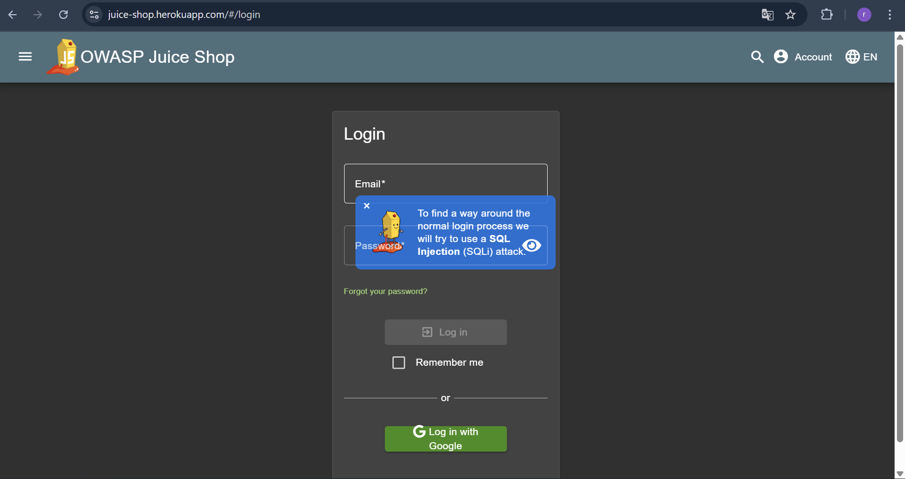
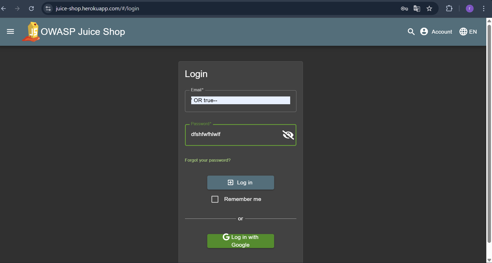

## LOGIN ADMIN

Revalina Fairuzy Azhari Putri / 5027231001

Source: https://demo.owasp-juice.shop/#/score-board?categories=Injection

**Langkah-langkah:**

1. Masuk ke section login pada web OWASP Juice Shop. Disini kita diminta untuk masuk ke sistem sebagai admin.

2. Pada *case* ini kita akan menggunakan pola SQL Injection. Kita coba dengan menggunakan "OR true--".

3. Kita masukkan password bebas dengan kombinasi yang tidak ditentukan.

4. Kita telah berhasil masuk sebagai admin ke dalam sistem, terbukti saat kita klik *login button*, akan tertampil email admin sebagai *default* kita (admin@juice-sh.op)

Dari hasil di atas, dapat diketahui

- Hasil: Berhasil

- Alasan: Login berhasil karena query SQL yang dijalankan oleh aplikasi tidak melakukan validasi input dengan baik. Dengan menambahkan pola OR true--, kondisi pada bagian WHERE selalu bernilai benar sehingga sistem mengabaikan password asli dan langsung mengautentikasi sebagai admin.

- Refleksi: Percobaan ini menunjukkan pentingnya sanitasi input dan penggunaan parameterized query dalam aplikasi web. Tanpa mekanisme keamanan tersebut, penyerang dapat dengan mudah mengakses akun penting seperti admin hanya dengan manipulasi sederhana.