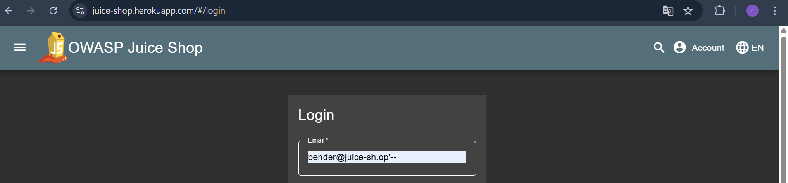
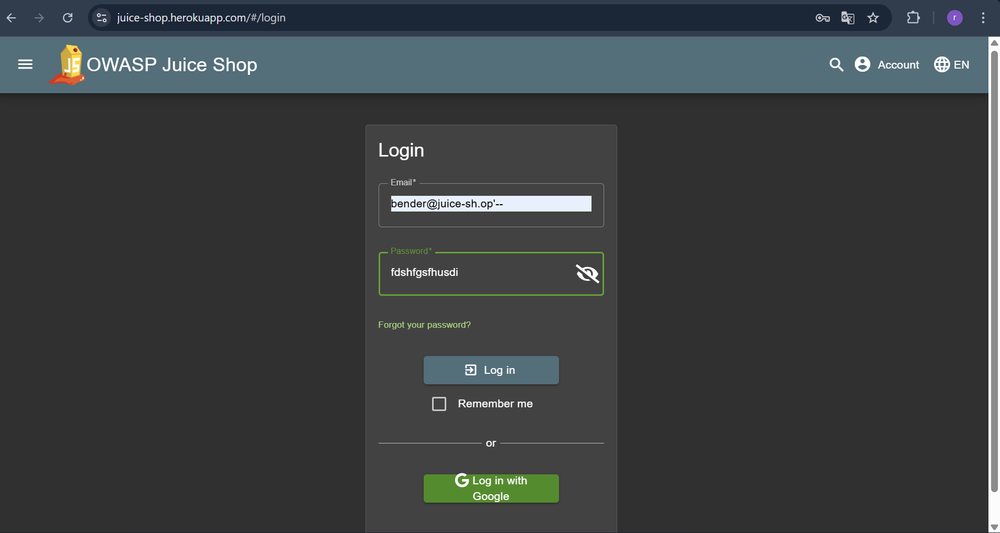
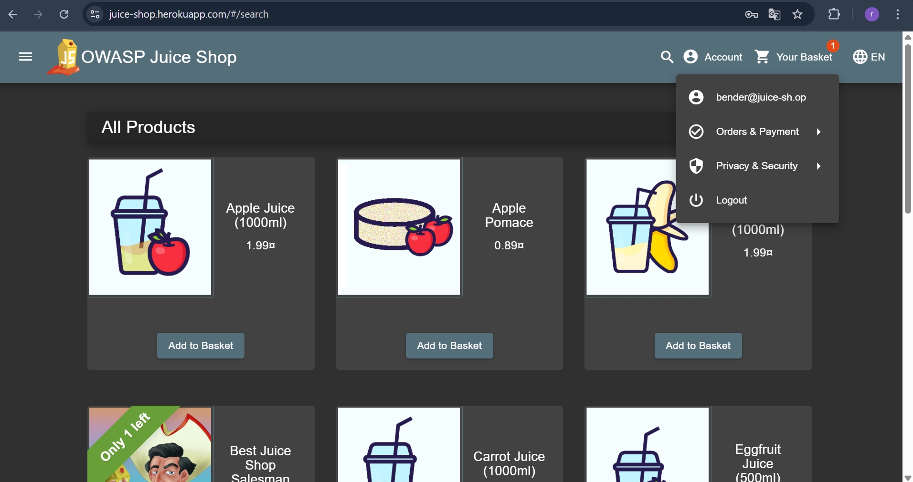

## LOGIN BENDER

Revalina Fairuzy Azhari Putri / 5027231001

Source: 

**Langkah-langkah:**

1. Dalam *case* ini kita diminta untuk masuk ke dalam sistem sebagai Bender. Dengan menggunakan teknik OSINT, kita bisa mencari nama email dari Bender, dan terbukti dapat ditemukan di kumpulan kolom *review*.

Setelah mendapatkan *email name* dari Bender, kita ketikkan pada section yang ada. Dengan menggunakan SQL Injection, kita akan memberikan command untuk mencoba melakukan *bypass* pada akun bender, dengan mengetikkan bender@juice-sh.op'--

2. Kita bisa masukkan *password* bebas pada *section* yang tersedia.

3. Kita berhasil masuk sebagai Bender disini, terbukti dari tampilan pada *login button* yang ada, tertampil *email* dari Bender.
