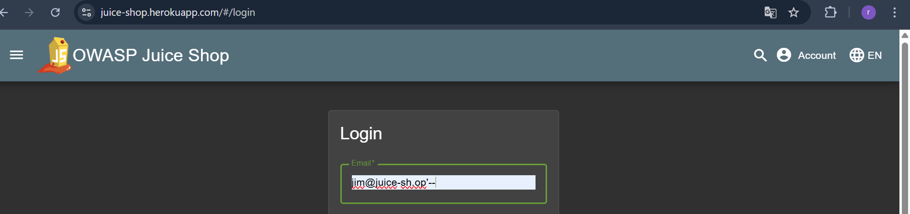
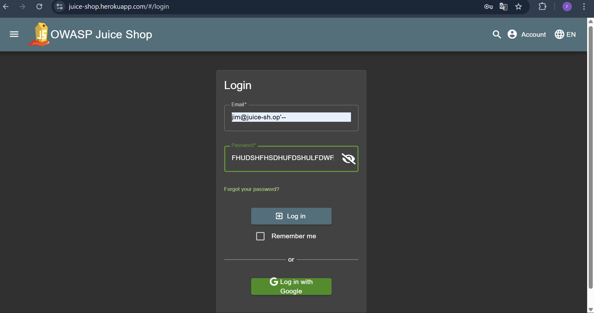
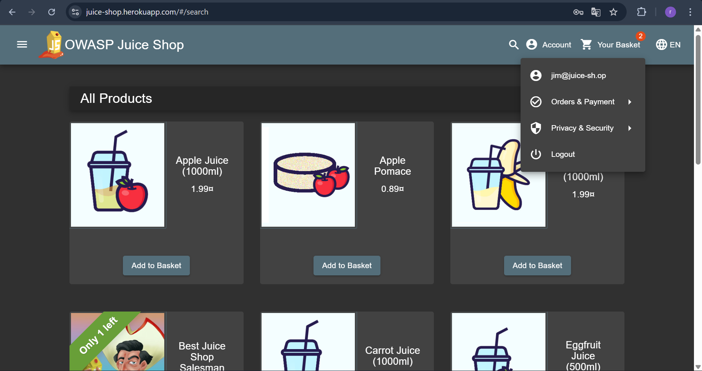

## LOGIN JIM

Revalina Fairuzy Azhari Putri / 5027231001

Source: https://demo.owasp-juice.shop/#/score-board?categories=Injection

**Langkah-langkah:**

1. Pada case ini kita diminta masuk ke dalam sistem sebagai Jim. Dengan menggunakan OSINT, kita cari *email name* dari JIM. Hal ini bisa didapatkan dari kumpulan review untuk produk-produk yang ada, kita akan menemukan *email name* Jim disana. Setelah menemukan, masuk *email name* tersebut ke section *login*

Kembali menggunakan SQL Injection, kita coba menambahkan command untuk membypass akun JIm, sehingga *email* menjadi jim@juice-sh.op'--

2. Kita kembali masukkan password bebas pada *section* yang telah disediakan untuk password.

3. Kita telah berhasil masuk sebagai Jim pada sistem, terbukti saat kita buka *login* info kita tertampil email Jim.

Dari hasl di atas, dapat diketahui

- Hasil: Berhasil

- Alasan: Login sebagai Jim berhasil karena alamat email Jim dapat ditemukan lewat OSINT pada review produk. Dengan menambahkan SQL Injection jim@juice-sh.op'--, query yang dijalankan sistem mengabaikan password sehingga autentikasi tetap diterima.

- Refleksi: Percobaan ini memperlihatkan bahwa data publik seperti review dapat menjadi celah serius jika digabungkan dengan kerentanan SQL Injection. Dari sisi keamanan, penting bagi aplikasi untuk menerapkan proteksi input, parameterized query, serta membatasi informasi sensitif yang ditampilkan secara terbuka.