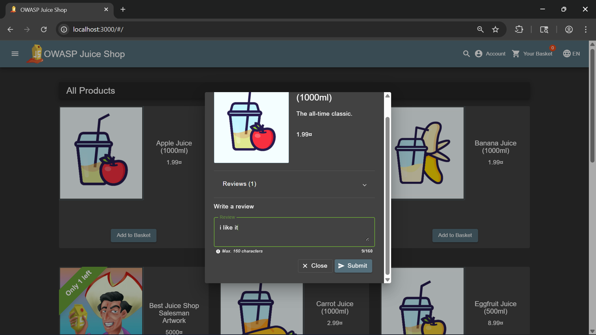
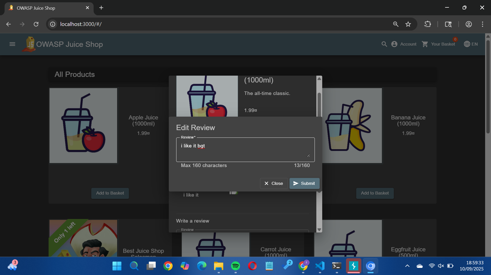
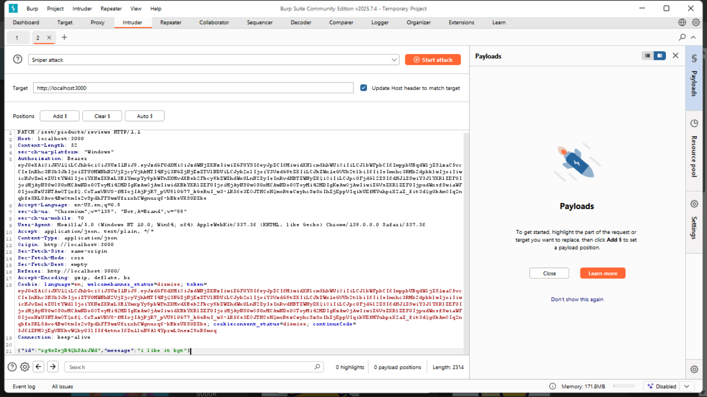
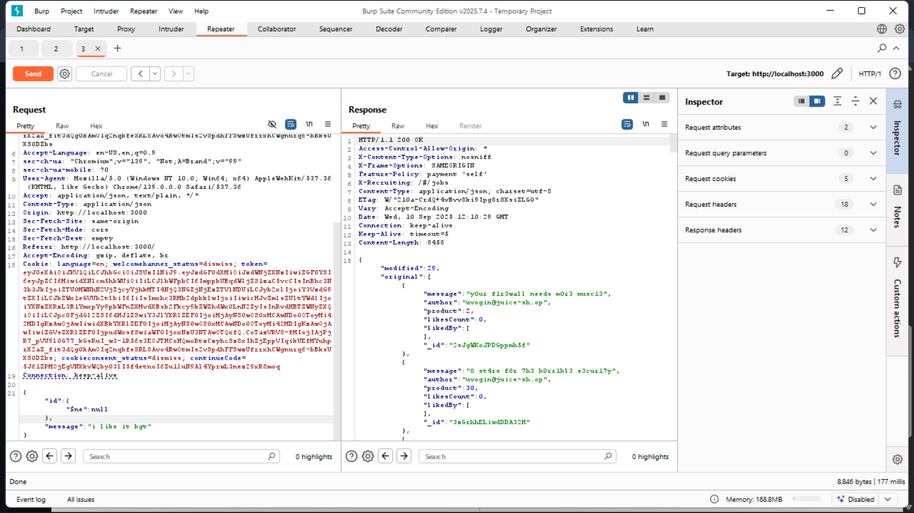

## NoSQL MANIPULATION

Revalina Fairuzy Azhari Putri / 5027231001

Source: https://demo.owasp-juice.shop/#/score-board?categories=Injection

**Langkah-langkah:**

1. Masukkan suatu review pada suatu produk, boleh random.

2. Nyalakan intruder, lalu lalukan edit pada review yang telah dibuat tadi.

3. Pilih command `PATCH` lalu send to repeater, dan edit ID nya menjadi `{ "$ne": null }` lalu send

4. Tertampil query backend tidak memfilter hanya suatu review, melainkan menerima $ne sebagai kondisi keseluruhan.

- Hasil: Berhasil

- Alasan: Dengan memanfaatkan request PATCH untuk edit review, ID yang semula spesifik diubah menjadi { "$ne": null }. Karena backend tidak melakukan validasi terhadap input JSON, query NoSQL menerima kondisi $ne (not equal) yang berarti “semua ID yang tidak null”. Akibatnya, perubahan tidak lagi terbatas pada satu review, melainkan dapat memengaruhi keseluruhan data review.

Refleksi: Percobaan ini menyoroti bahwa kerentanan tidak hanya ada di SQL, tapi juga pada NoSQL Injection/Manipulation. Jika input tidak divalidasi, operator khusus seperti $ne bisa dieksploitasi untuk memanipulasi query. 