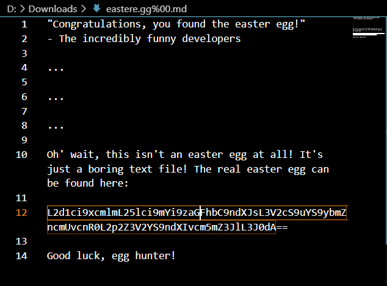
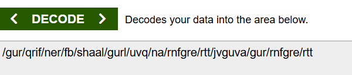
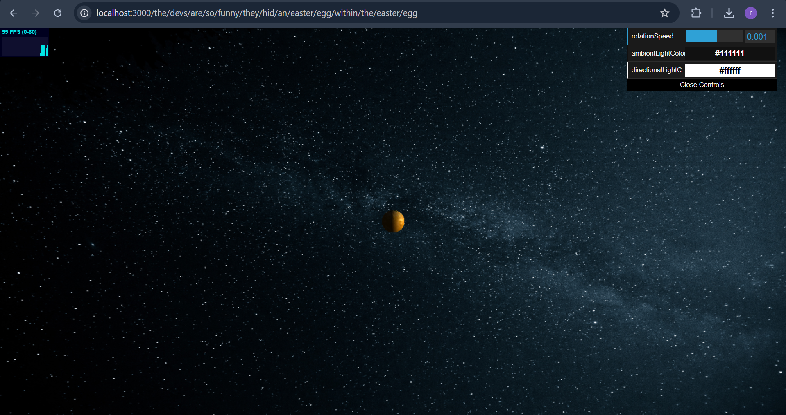

## Nested Easter Egg

Revalina Fairuzy Azhari Putri / 5027231001

Source: http://localhost:3000/#/score-board?categories=Cryptographic%20Issues

**Langkah-langkah:**

1. Akses dan download file .md pada link berikut `http://localhost:3000/ftp/eastere.gg%2500.md`

2. Decode token yang tertampil (bisa menggunakan web decode) yaitu: `L2d1ci9xcmlmL25lci9mYi9zaGFhbC9ndXJsL3V2cS9uYS9ybmZncmUvcnR0L2p2Z3V2YS9ndXIvcm5mZ3JlL3J0dA==`

- `hasil: /gur/qrif/ner/fb/shaal/gurl/uvq/na/rnfgre/rtt/jvguva/gur/rnfgre/rtt`

3. Decode dengan menggunakan rot13 hasil pada step sebelumnya

- `hasil: /the/devs/are/so/funny/they/hid/an/easter/egg/within/the/easter/egg1`

4. Akses `http://localhost:3000/the/devs/are/so/funny/they/hid/an/easter/egg/within/the/easter/egg`, sehingga menampilkan web berikut. Challenge berhasil tersolve.

- Hasil: Challenge Nested Easter Egg berhasil terselesaikan setelah melakukan serangkaian decoding. Path tersembunyi yang ditemukan adalah: `/the/devs/are/so/funny/they/hid/an/easter/egg/within/the/easter/egg` 

- Alasan: Challenge ini menggunakan beberapa teknik penyembunyian berlapis, yaitu null-byte injection (%2500), encoding Base64, dan enkripsi sederhana ROT13. Setiap lapisan hanya terlihat seperti teks biasa sampai dilakukan decoding yang sesuai. Hal ini menunjukkan bahwa meskipun encoding sederhana bukanlah kriptografi yang kuat, lapisan-lapisan ini bisa digunakan developer untuk membuat “easter egg” yang tidak langsung terlihat.

- Refleksi: keamanan tidak bisa hanya mengandalkan penyembunyian informasi dengan encoding atau enkripsi sederhana. Teknik seperti Base64 dan ROT13 mudah dipatahkan, sehingga tidak efektif jika digunakan untuk melindungi data sensitif. Namun, challenge ini memberikan pemahaman yang baik tentang bagaimana informasi bisa disembunyikan secara berlapis dan melatih ketelitian dalam mengidentifikasi jenis encoding yang digunakan.