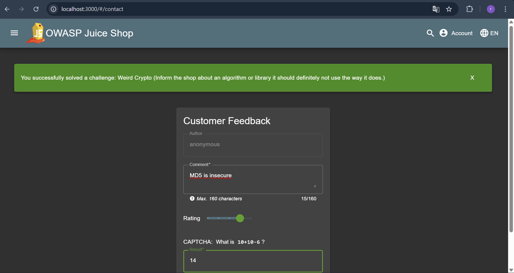

## Weird Crypto

Revalina Fairuzy Azhari Putri / 5027231001

Source: http://localhost:3000/#/score-board?categories=Cryptographic%20Issues

**Langkah-langkah:**

1. Masuk pada bagian Menu lalu Customer Feedback

2. Ketikkan "MD5 is insecure" pada kolom review, lalu isi bebas untuk rating dan jangan lupa inputkan captchanya. Challenge telah tersolve.

- Hasil: berhasil menyelesaikan challenge Weird Crypto dengan mengirimkan umpan balik melalui menu Customer Feedback berisi teks "MD5 is insecure". Setelah submit, Juice Shop langsung menandai challenge sebagai solved.

- Alasan: Juice Shop pada challenge ini menggunakan mekanisme trigger berbasis kata kunci sebagai bukti bahwa pengguna memahami adanya penggunaan algoritma kriptografi yang tidak sesuai. Kata kunci MD5 dipakai karena MD5 secara praktis sudah tidak aman untuk tujuan keamanan: rentan terhadap collision attacks, sangat cepat sehingga mempermudah serangan brute-force atau penggunaan rainbow tables, dan tidak cocok untuk hashing password atau tanda tangan digital. Dengan mengirimkan komentar yang menyebutkan MD5, sistem menganggap pengguna telah mengidentifikasi “weird crypto” yang dimaksud dan memverifikasi challenge sebagai selesai.

- Refleksi: tidak semua penyelesaian harus melalui eksploitasi teknis yang rumit. Terkadang, memahami konteks dan membaca alur aplikasi sudah cukup untuk menemukan celah yang dimaksud. Penggunaan MD5 sebagai contoh algoritma kriptografi yang sudah usang menjadi pengingat bahwa praktik keamanan yang buruk masih sering ditemukan pada sistem lama. Hal ini menegaskan pentingnya memilih algoritma yang sesuai standar modern, serta selalu melakukan evaluasi ulang agar sistem tidak bergantung pada teknologi yang sudah tidak aman.